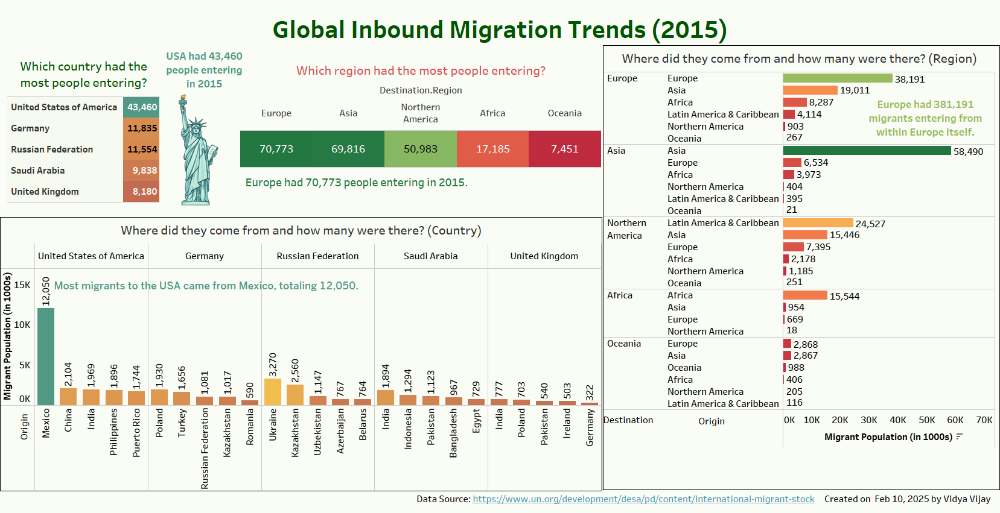

# 🌍 World Migration Dashboard (2015) - Tableau

## 📌 Overview
This Tableau dashboard visualizes migration trends based on the **2015 World Migration Data** from the **United Nations, Department of Economic and Social Affairs, Population Division**. It helps to analyze migration inflows and outflows by country and region.

## 📊 Dashboard Objectives
Using Tableau, this dashboard provides answers to two key migration-related questions:

### **1️⃣ Countries with the Most Migration Inflows**
- Identifies the **top 5 countries** receiving the most migrants.
- Displays the **origin countries** of these migrants along with their respective counts.
- Provides a **regional breakdown** of migration inflows.
- All visualizations for this question are presented on a **single dashboard**.

### **2️⃣ Countries with the Second Highest Migration Outflows**
- Identifies the **second-highest country** in terms of migration outflows.
- Displays the **top 5 destination countries** of the migrants and their numbers.
- Provides a **regional breakdown** of migration outflows.
- All visualizations for this question are presented on a **single dashboard**.

## 📂 Files Included
- 📄 `Migration Dashboard.twbx` → Tableau Packaged Workbook
- 📊 `Dashboard 1.png` → Dashboard 1 Preview Image
- 📊 `Dashboard 2.png` → Dashboard 2 Preview Image
- 📄 `README.md` → Project Instructions
- 📂 `Data/` → Raw migration data xls 

## 🚀 How to Use the Dashboard
1. **Download and Open**
   - Download the `Migration Dashboard.twbx` and the data file file from this repository.
   - Open it in **Tableau Desktop**.

2. **Explore the Visualizations**
   - View migration patterns for **top inflow and outflow countries**.
   - Analyze **regional migration** trends.
   - Use **filters** to customize the visualization based on specific criteria.

3. **Modify and Extend**
   - Modify the filters to explore migration trends for different years or country groups.
   - Enhance the dashboard by integrating additional visualizations.

## 📊 Sample Dashboard Preview

## Source:
https://www.un.org/development/desa/pd/content/international-migrant-stock
Destination and Origin (2015)

---
💡 *Feedback and contributions are welcome! Feel free to fork and modify the dashboard.* 🚀
